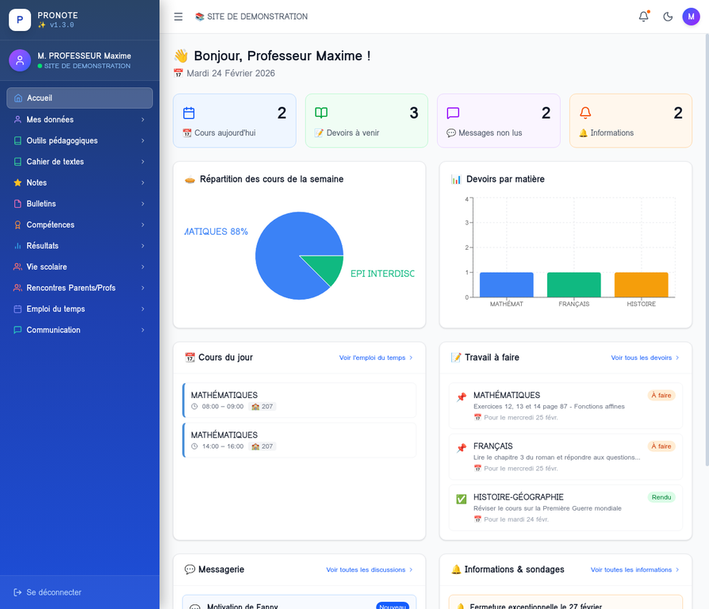
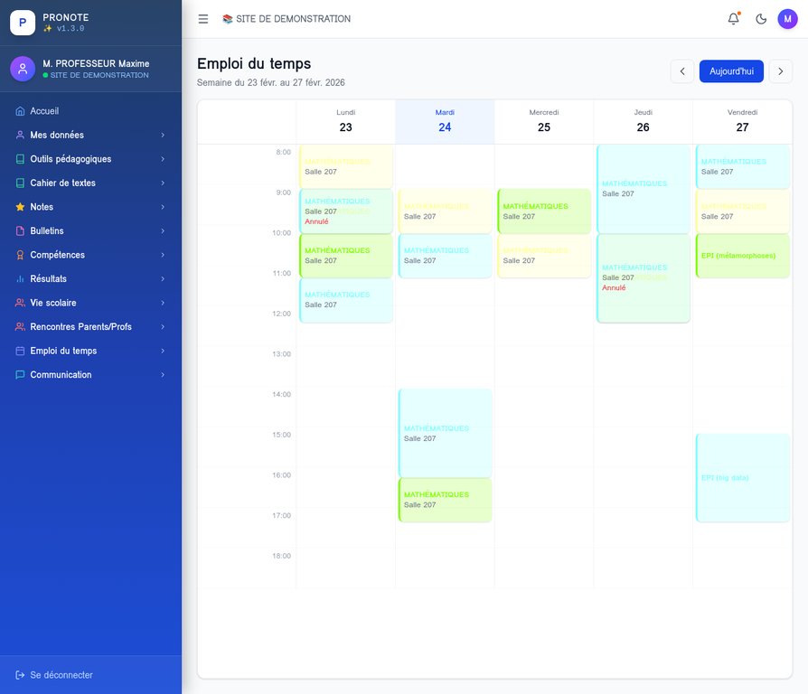
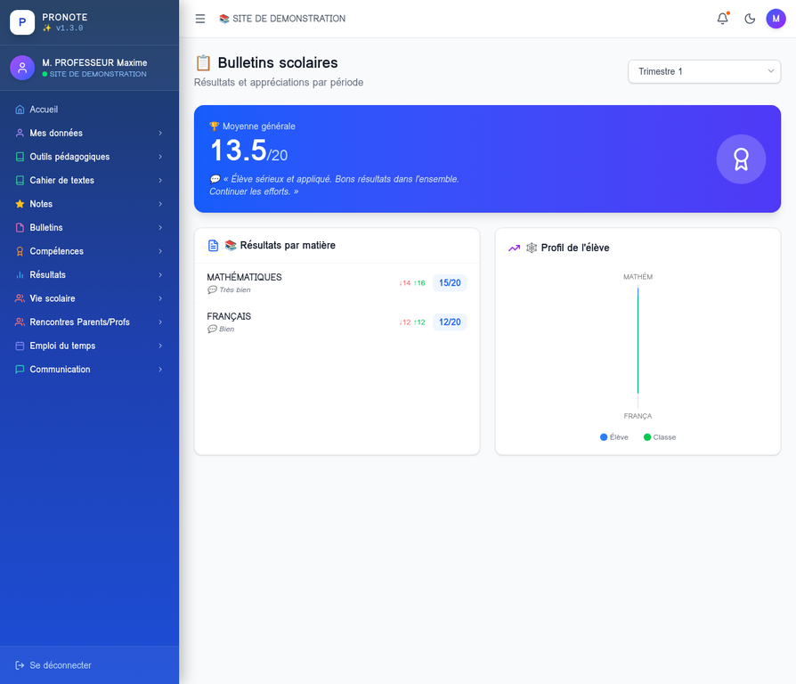
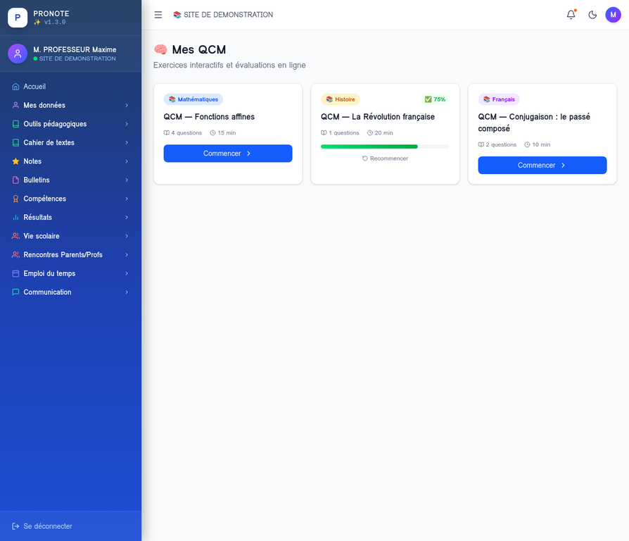

<p align="center">
  <b>PRONOTE Desktop</b>
</p>

<h1 align="center">Pronote Desktop</h1>

<p align="center">
  Application native <strong>Pronote</strong> pour Linux et macOS<br/>
  Accédez à votre espace Pronote directement depuis votre bureau, sans navigateur.
</p>

<p align="center">
  
  
  
  
  
  
</p>

---

## 📸 Aperçu

| 🏠 Tableau de bord | 📅 Emploi du temps |
|:---:|:---:|
|  |  |

| 📋 Bulletins scolaires | 🧠 QCM interactifs |
|:---:|:---:|
|  |  |

---

## Présentation

**Pronote Desktop** est une application de bureau native qui permet d'utiliser Pronote sous Linux et macOS sans avoir à ouvrir un navigateur web. Elle reproduit fidèlement toutes les fonctionnalités de l'interface web officielle Pronote, avec en plus :

- Un **mode sombre** intégré et persistant
- Une **interface responsive** adaptée aux différentes tailles d'écran
- L'authentification par **QR Code (OTP)** en plus du login classique
- Une **remontée automatique des erreurs** vers GitHub Issues
- Une **mise à jour de version automatique** à chaque build

### État du projet

- Stabilisation active et tests de non-régression automatisés jusqu'à la version `1.7.11`.
- Correctifs runtime Linux livrés: anti-crash GPU, vérification backend, smoke test de déploiement, et parcours UI e2e.
- La mise à jour intégrée (depuis Paramètres) vérifie les releases GitHub et propose l'installation automatique du paquet `.deb` compatible.

---

## Fonctionnalités

| Module | Description | Statut |
|---|---|---|
| **Tableau de bord** | Vue synthétique : cours du jour, devoirs, messages, infos | Opérationnel |
| **Emploi du temps** | Planning hebdomadaire avec navigation par semaine | Opérationnel |
| **Notes** | Relevé de notes par trimestre, moyennes, min/max de classe | Opérationnel |
| **Cahier de textes** | Devoirs à faire, filtres par statut et date | Opérationnel |
| **Messagerie** | Discussions complètes avec réponse intégrée | Opérationnel |
| **Informations** | Informations de l'établissement et sondages | Opérationnel |
| **Vie scolaire** | Absences, retards, sanctions avec statut de justification | Opérationnel |
| **Authentification OTP** | Connexion par QR Code Pronote | Opérationnel |
| **Dark mode** | Thème clair/sombre persistant | Opérationnel |
| **Remontée d'erreurs** | Signalement automatique vers GitHub Issues | Opérationnel |

---

## Installation

### Ubuntu / Debian (recommandé)

```bash
# Télécharger la derniere release depuis GitHub
ASSET_URL="$(curl -fsSL https://api.github.com/repos/Tarzzan/pronote-desktop/releases/latest \
  | grep -Eo 'https://[^"]+_amd64\.deb' \
  | head -n 1)"
wget -O pronote-desktop_latest_amd64.deb "$ASSET_URL"

# Installer le paquet
sudo dpkg -i pronote-desktop_latest_amd64.deb

# Résoudre les dépendances si nécessaire
sudo apt-get install -f
```

L'application apparaît dans le menu **Applications → Éducation → Pronote Desktop**.

### Depuis les sources

```bash
# Prérequis : Node.js >= 22.12, pnpm 10+, Python 3.11+
git clone https://github.com/Tarzzan/pronote-desktop.git
cd pronote-desktop

# Installer les dépendances Node
pnpm install

# Démarrer en mode développement
pnpm dev

# Construire pour la production
node scripts/bump-version.cjs   # Incrémenter la version
pnpm build:web                  # Compiler le frontend
pnpm build:deb                  # Générer le .deb dans release/
```

---

## Connexion et authentification

### Méthode 1 — Login classique

1. Renseignez l'URL de votre établissement (ex: `https://0290009c.index-education.net/pronote/`)
2. Entrez votre identifiant et votre mot de passe Pronote
3. Cliquez sur **Se connecter**

### Méthode 2 — QR Code (OTP)

1. Sur l'application mobile Pronote, allez dans **Paramètres → Connexion par QR Code**
2. Cliquez sur **Connexion par QR Code** dans l'application desktop
3. Scannez le QR Code affiché à l'écran avec votre mobile
4. Entrez le code PIN à 4 chiffres affiché sur votre mobile

### Compte de démonstration

Pour tester l'application sans compte Pronote :

| Champ | Valeur |
|---|---|
| URL | `https://demo.index-education.net/pronote/professeur.html` |
| Identifiant | `demonstration` |
| Mot de passe | `pronotevs` |

---

## Architecture technique

```
pronote-desktop/
├── electron/
│   ├── main.cjs          # Processus principal Electron (fenêtre + erreurs)
│   └── preload.cjs       # Bridge sécurisé Electron ↔ React
├── src/
│   ├── components/
│   │   ├── layout/
│   │   │   ├── MainLayout.tsx    # Layout principal (sidebar + header)
│   │   │   └── Sidebar.tsx       # Navigation latérale avec sous-menus
│   │   └── ErrorBoundary.tsx     # Gestion des erreurs React + GitHub Issues
│   ├── lib/
│   │   ├── pronote/
│   │   │   ├── client.ts         # Client API Pronote (TypeScript)
│   │   │   └── crypto.ts         # Chiffrement AES-256-CBC
│   │   └── store/
│   │       └── authStore.ts      # État global (Zustand)
│   ├── pages/
│   │   ├── LoginPage.tsx         # Connexion (classique + QR Code)
│   │   ├── DashboardPage.tsx     # Tableau de bord
│   │   ├── TimetablePage.tsx     # Emploi du temps
│   │   ├── GradesPage.tsx        # Notes
│   │   ├── HomeworkPage.tsx      # Cahier de textes
│   │   ├── MessagingPage.tsx     # Messagerie
│   │   ├── AttendancePage.tsx    # Vie scolaire
│   │   ├── InformationsPage.tsx  # Informations & sondages
│   │   └── PlaceholderPage.tsx   # Page générique pour sections futures
│   └── types/
│       └── pronote.d.ts          # Interfaces TypeScript Pronote
├── pronote_api.py        # Backend Python Flask (proxy API Pronote)
├── scripts/
│   └── bump-version.cjs  # Script d'incrémentation de version automatique
└── .github/
    └── workflows/
        └── build.yml     # CI/CD : build automatique du .deb sur push
```

### Stack technique

| Couche | Technologie | Version | Rôle |
|---|---|---|---|
| Interface | React | 19.x | Composants UI |
| Langage | TypeScript | 5.x | Typage statique |
| Build | Vite | 7.x | Bundler de production |
| Style | Tailwind CSS | 4.x | Styles utilitaires |
| État | Zustand | 5.x | Gestion d'état global |
| Routing | React Router | 7.x | Navigation SPA |
| Desktop | Electron | 40.x | Shell natif Linux/macOS |
| API Pronote | pronotepy | 3.x | Bibliothèque Python Pronote |
| Backend proxy | Flask + Flask-CORS | 3.x | Serveur API local |
| Dates | date-fns | 4.x | Formatage des dates en français |

---

## Remontée d'erreurs

En cas de bug dans l'application :

1. Une boîte de dialogue s'affiche automatiquement avec le message d'erreur
2. L'utilisateur clique sur **"Signaler sur GitHub"**
3. Son navigateur s'ouvre sur une Issue GitHub **pré-remplie** avec :
   - La version de l'application
   - Le système d'exploitation
   - La stack trace complète
   - L'arbre des composants React

Vous pouvez également [ouvrir une Issue manuellement](https://github.com/Tarzzan/pronote-desktop/issues/new?template=bug_report.md).

---

## CI/CD

Le fichier `.github/workflows/build.yml` déclenche automatiquement :

- Sur chaque `push` sur `main` : lint, tests routes/contraste/updater, smoke e2e UI, tests backend + build du `.deb`
- Sur chaque tag `v*` (ex: `git tag v1.3.0`) : création d'une Release GitHub avec le `.deb` en pièce jointe

---

## Changelog

Consultez l'historique complet des versions dans [CHANGELOG.md](CHANGELOG.md).

---

## Contribuer

1. Forkez le dépôt
2. Créez une branche : `git checkout -b feature/ma-fonctionnalite`
3. Committez : `git commit -m 'feat: ajouter ma fonctionnalité'`
4. Poussez : `git push origin feature/ma-fonctionnalite`
5. Ouvrez une Pull Request

---

## Licence

MIT — Ce projet est une application cliente non officielle. Pronote est une marque déposée d'Index Éducation. Ce projet n'est pas affilié à [Index Education](https://www.index-education.com/).
